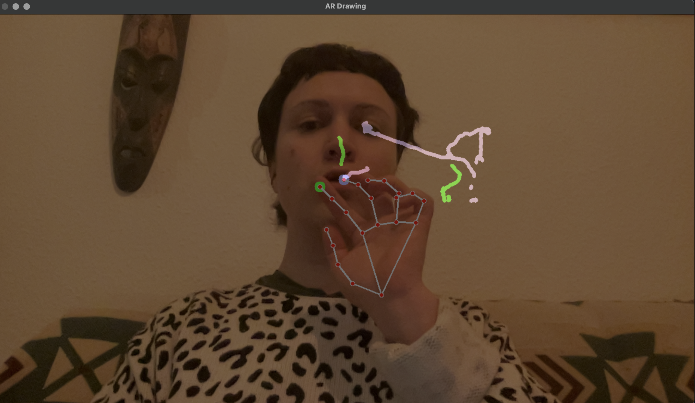

# AR_practice 🎨🖐️

An Augmented Reality (AR) Drawing App built with OpenCV and MediaPipe in Python. This project enables real-time hand tracking to draw on a virtual canvas using your index or middle finger, with an eraser mode when both fingers are close together.

----

✨ Features :

✔️ Real-time Webcam Capture 📷

✔️ Hand & Finger Tracking ✋

✔️ Draw with Index or Middle Finger 🖌️

✔️ Eraser Mode (Two Fingers Close Together) 🧽

✔️ Clear Canvas with 'C' Key 🔄

----
🚀 How It Works :

- Move your index finger to draw in green.

- Move your middle finger to draw in pink.

- Touch both fingers together to erase.

- Press 'C' to clear the canvas.

- Press 'Q' to exit the app.

----

🛠️ Technologies Used :

- Python 🐍

- OpenCV (Computer Vision)

- MediaPipe (Hand Tracking)

- NumPy (Numerical Computations)

----

Next Steps :

🎨 1. Color Selection

Right now, the colors are fixed (green for index, pink for middle). We can make this more interactive by letting users choose colors dynamically.

Ways to Implement Color Selection:

✅ Hand Gestures:

Show three fingers (e.g., index + middle + ring) to cycle through colors.

A thumbs-up gesture to confirm a color.

✅ Keyboard Shortcuts:

Press 'R' for Red, 'G' for Green, 'B' for Blue, etc.

✅ On-Screen Palette:

Display a small color palette overlay, where users can hover their finger over a color to select it.

🖐️ 2. Gesture-Based UI

Instead of relying on keyboard shortcuts, we can use hand gestures to control the app.

Possible Gestures & Actions:

👉 Thumbs-up = Start drawing mode

👉 Thumbs-down = Erase mode

👉 Palm Open = Clear the canvas

👉 Fist = Pause drawing (freeze the screen)

👉 Pinch Gesture = Adjust brush size
