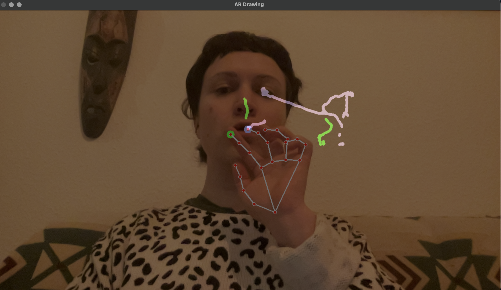

# Augmented Reality Drawing App



An Augmented Reality (AR) Drawing App built with OpenCV and MediaPipe in Python.
This project enables real-time hand tracking to draw on a virtual canvas using your index or middle finger, with eraser mode triggered when both fingers are close together.

----

✨ Features :

✔️ Real-time Webcam Capture 📷

✔️ Hand & Finger Tracking ✋

✔️ Draw with Index Finger🖌️

✔️ Eraser Mode (Two Fingers Close Together) 🧽

✔️ Clear Canvas with 'C' Key 🔄

✔️ Color Switching with 'N' Key 🎨


----
🚀 How It Works :

- Move your index finger to draw in green.

- The drawing color changes when you press 'n' (cycle through preset colors).

- Touch your index and middle fingers together to erase.

- Press 'C' to clear the canvas.

- Press 'Q' to exit the app.

You’ll also see helpful on-screen cues like "erasing" or "drawing" based on your hand gestures.

----

🛠️ Technologies Used :

- Python 🐍

- OpenCV (Computer Vision)

- MediaPipe (Hand Tracking)

- NumPy (Numerical Computations)

----

```md
## 🚀 Future Enhancements  

### 🎨 1. Color Selection  
- **Hand Gestures:** Show three fingers to cycle through colors, thumbs-up to confirm.  
- **Keyboard Shortcuts:** 'R' for Red, 'G' for Green, 'B' for Blue, etc.  
- **On-Screen Palette:** Hover over a virtual palette to select a color.  

### 🖐️ 2. Gesture-Based UI  
- **Thumbs-up 👍** → Start drawing  
- **Thumbs-down 👎** → Erase mode  
- **Palm Open ✋** → Clear the canvas  
- **Fist ✊** → Pause drawing  
- **Pinch Gesture 🤏** → Adjust brush size
